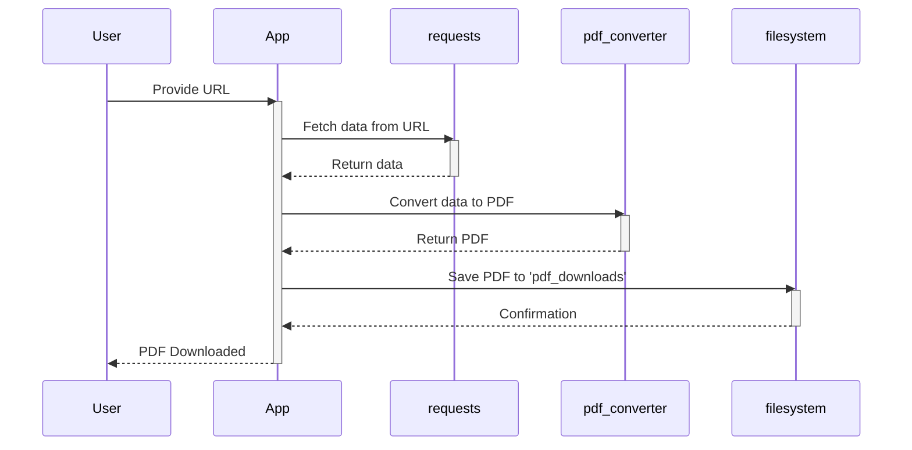

# Sample Readme

- 
- [Flow Diagram](images/flow-chart.mermaid)

Here is the markdown code to match the styling and content you provided:

# MLflow Models Lifecycle

## Packages

| Repository      | Version |  Package |
| --------------- |:-------:|:--------:|
| **PyPI**        | [v2.17.0](https://pypi.org/project/mlflow/) | [MLflow-skinny v2.17.0](https://pypi.org/project/mlflow-skinny/) |
| **conda-forge** | [v2.17.0](https://anaconda.org/conda-forge/mlflow) | [MLflow-skinny v2.17.0](https://anaconda.org/conda-forge/mlflow-skinny) |
| **CRAN**        | [v2.16.2](https://cran.r-project.org/package=mlflow) | |
| **Maven Central**| [MLflow-client v2.17.0](https://mvnrepository.com/artifact/org.mlflow/mlflow-client) | [MLflow-parent v2.17.0](https://mvnrepository.com/artifact/org.mlflow/mlflow-parent)   [MLflow-scoring v2.17.0](https://mvnrepository.com/artifact/org.mlflow/mlflow-scoring)   [MLflow-spark v2.17.0](https://mvnrepository.com/artifact/org.mlflow/mlflow-spark) |

## Job Statuses

| Task               | Status |
| ------------------ |:------:|
| **Examples**       |  |
| **Cross Version Tests** |  |
| **R-devel**        |  |
| **Test Requirements** |  |
| **Stale**          |  |
| **Push-Images**    |  |
| **Slow-tests**     |  |
| **Website-E2E**    |  |

You can replace the URLs in the brackets with actual links from your project if necessary. The shields are generated using standard badge creation from shields.io.