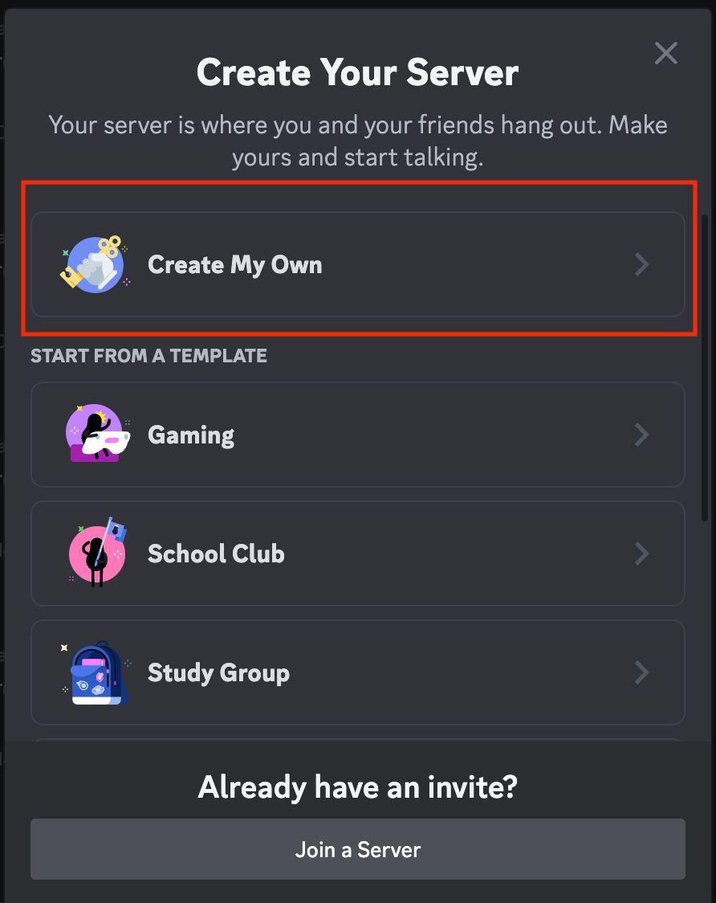
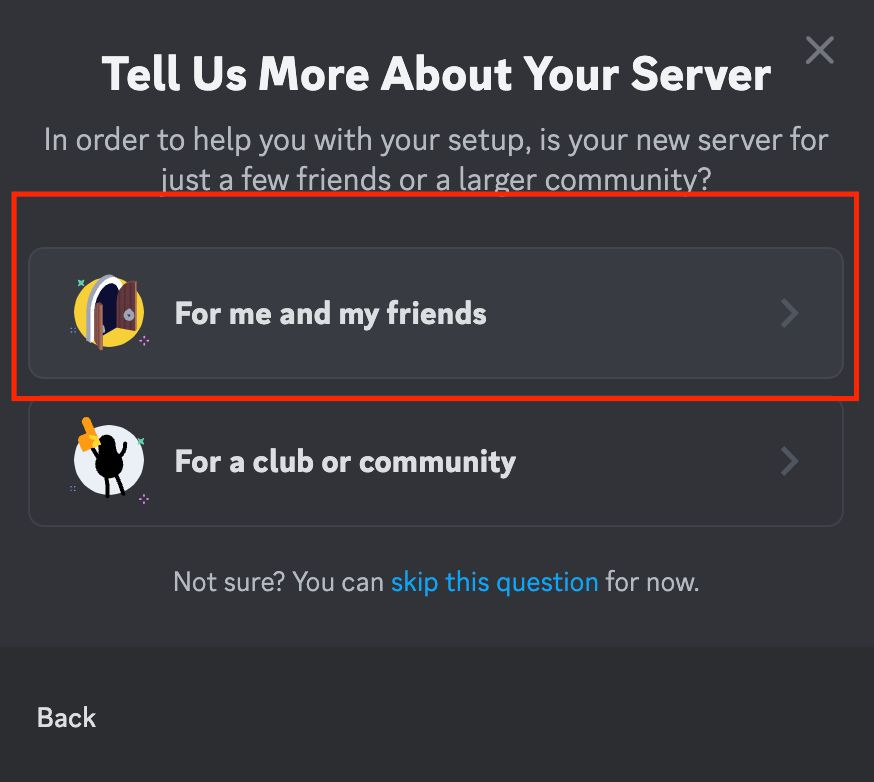
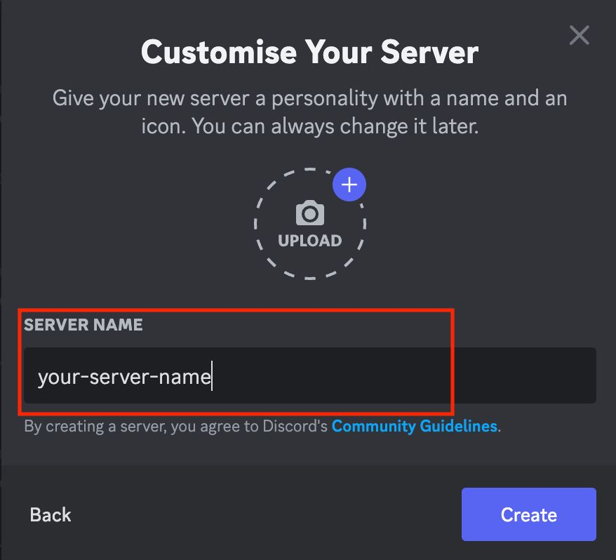
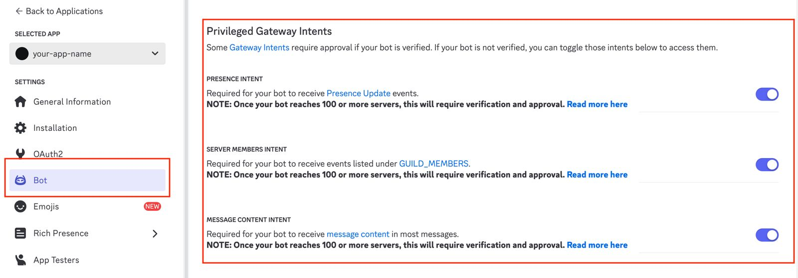
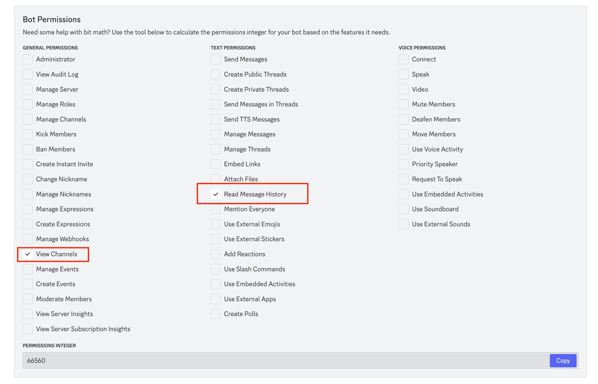
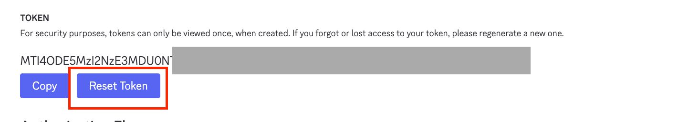
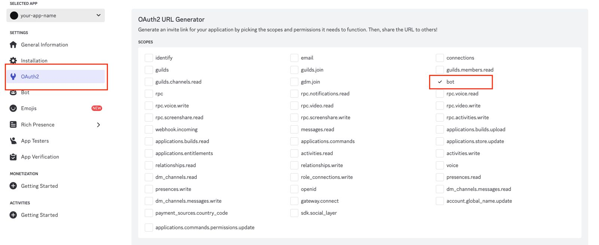
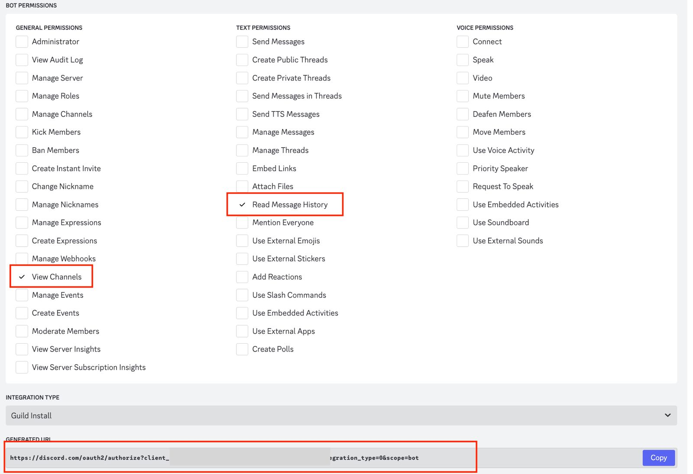
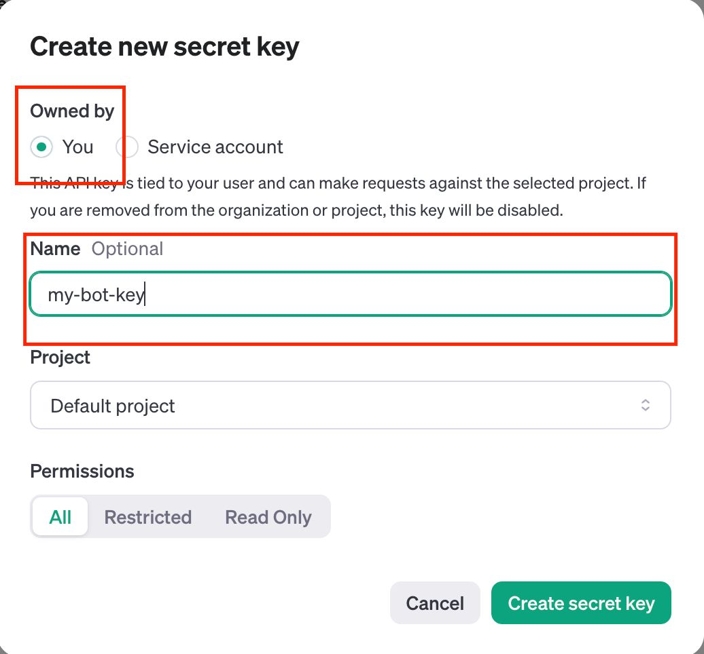

# How to Create a Discord Bot That Uses ChatGPT to Answer Messages

If you're a beginner in Python and want to create a simple but powerful Discord bot that leverages ChatGPT for answering messages, you're in the right place! In this article, we'll guide you step-by-step on how to create your own Discord bot using the OpenAI API to power its responses.

By the end of this tutorial, you'll have a functional Discord bot that replies to user messages using ChatGPT, with all the necessary permissions and configurations set up.

---

## Prerequisites
- Basic knowledge of Python programming
- A Discord account
- An OpenAI API key (We will cover how to generate this)

---

## Step 1: Create a Discord Server

First things first, you need to create your own Discord server where your bot will live.

1. **Go to Discord** and click on the 'Add a Server' button, located on the left sidebar.
2. **Choose 'Create My Own'** from the available options.
3. **Select 'For me and my family'**, unless you’re making it for a larger community.
4. **Name your server** and, if you’d like, add an icon.
   
   Once your server is set up, your bot will be able to join and interact with users here!





---

## Step 2: Create an App in the Discord Developer Portal

Next, we’ll create the bot that will live in your server.

1. **Go to the Discord Developer Portal**: [Discord Developer Portal](https://discord.com/developers/docs/quick-start/getting-started#step-1-creating-an-app)
2. **Create a New Application** by clicking the "New Application" button.
3. **Name your app** something meaningful, like "YogaGPT Bot".
4. **Navigate to the Bot option** in the sidebar, and create a bot by clicking "Add Bot". This will allow you to manage the permissions for your bot.
5. **Grant permissions**:
   - Enable **Read Message History**
   - Enable **View Channel**

   This ensures your bot can access and read messages in the channel.

6. **Generate a Token**:
   - Scroll down to the "Token" section and click "Reset Token".
   - **Save the token** in a secure place; you will need it later.

7. **OAuth2 Configuration**:
   - Go to the "OAuth2" section and select "Bot" under scopes.
   - Add the necessary permissions, including **Read Message History** and **View Channel**.
   - A **generated link** will appear. You can use this link to invite your bot to your server.

###### Bot Privileges Gateway Intents




###### Bot Permissions




###### Bot URL



---

## Step 3: Get Your OpenAI API Key

Now, let's connect your bot with ChatGPT by using OpenAI's API.

1. **Create an API key** by going to the OpenAI website: [OpenAI API Key](https://platform.openai.com/api-keys)
2. Sign in or create an account.
3. **Generate a new API key** and save it securely as you'll need it later when writing the bot's code.




---

## Step 4: Code the Discord Bot

Now comes the exciting part—writing the Python code for your bot!

### Required Libraries
First, make sure you have the necessary libraries installed. You’ll need:
- `discord.py`: For creating the Discord bot.
- `openai`: To access ChatGPT’s API.
- `python-dotenv`: To handle environment variables securely.

Install them using pip:

```bash
pip install discord.py openai python-dotenv
```

### Code Breakdown

Below is the Python code that will allow your Discord bot to answer messages using ChatGPT.

```python
import os
import discord
import openai
from dotenv import load_dotenv
from openai import OpenAI

# Load the .env file containing the tokens
load_dotenv()

discord_bot_token = os.getenv("DISCORD_TOKEN")
openai_api_key = os.getenv("OPENAI_API_KEY")


class YogaGPT(discord.Client):

    async def on_ready(self):
        print(f'Logged on as {self.user}!')

    async def on_message(self, message):
        print(f'Message from {message.author}: {message.content}')

        # don't respond to ourselves
        if message.author == self.user:
            return

        response = await self.call_chat_gpt(message.content)
        await message.channel.send(response)

    async def call_chat_gpt(self, message):
        client = OpenAI(api_key=openai_api_key)

        try:
            response = client.chat.completions.create(
                model="gpt-3.5-turbo-instruct",
                messages=[{
                    "role": "user",
                    "content": message
                }],
                temperature=1,
                max_tokens=2048,
                top_p=1,
                frequency_penalty=0,
                presence_penalty=0,
                response_format={"type": "text"})
            return response["choices"][0]["message"]["content"]
        except openai.RateLimitError as e:
            print(e)
            return "Sorry, the bot has reached its API usage limit. Please try again later."

        except Exception as e:
            return f"An error occurred: {str(e)}"


def run_yoga_gpt():
    intents = discord.Intents.default()
    intents.message_content = True
    client = YogaGPT(intents=intents)
    client.run(discord_bot_token)

run_yoga_gpt()
```

---

### Explanation of the Code:
- **Loading Tokens**: The `.env` file stores your sensitive API tokens. We load these using `dotenv.load_dotenv()`.
- **Bot Class**: `YogaGPT` inherits from `discord.Client` and overrides the `on_ready` and `on_message` methods. 
    - `on_ready`: This method is called when the bot successfully connects to Discord.
    - `on_message`: When the bot receives a message, it passes the message to ChatGPT, gets a response, and sends it back to the channel.
- **ChatGPT API Call**: Inside the `call_chat_gpt()` method, the bot interacts with ChatGPT to generate a response based on the user’s message.

---

## Step 5: Set Up Environment Variables

To keep your API keys secure, it’s good practice to use environment variables. Create a `.env` file in the same directory as your Python script, and add the following:

```
DISCORD_TOKEN=your_discord_bot_token_here
OPENAI_API_KEY=your_openai_api_key_here
```

Replace `your_discord_bot_token_here` and `your_openai_api_key_here` with the actual keys generated earlier.

---

## Step 6: Running the Bot

Finally, run your bot by executing the script:

```bash
python your_bot_script.py
```

Once the bot is running, any message in your Discord server will be sent to ChatGPT, and it will reply with AI-generated responses!

---

## Conclusion

Congratulations! You've now built a fully functioning Discord bot that can respond to messages using ChatGPT. This project is a great way to dive deeper into both Discord bot development and the exciting world of AI text generation with OpenAI.

Feel free to explore more advanced features, such as handling commands, creating complex dialogues, or integrating with other APIs!

*Leave space for relevant image: Screenshot of the bot in action, responding to a message on Discord*