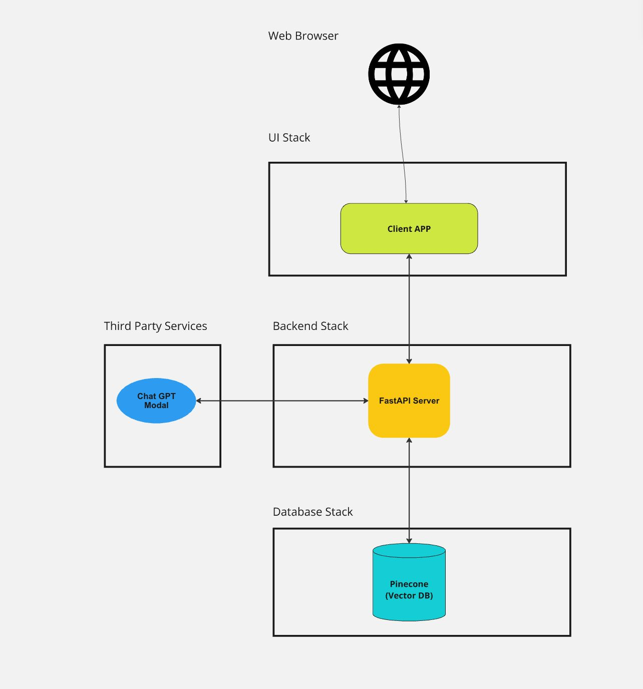
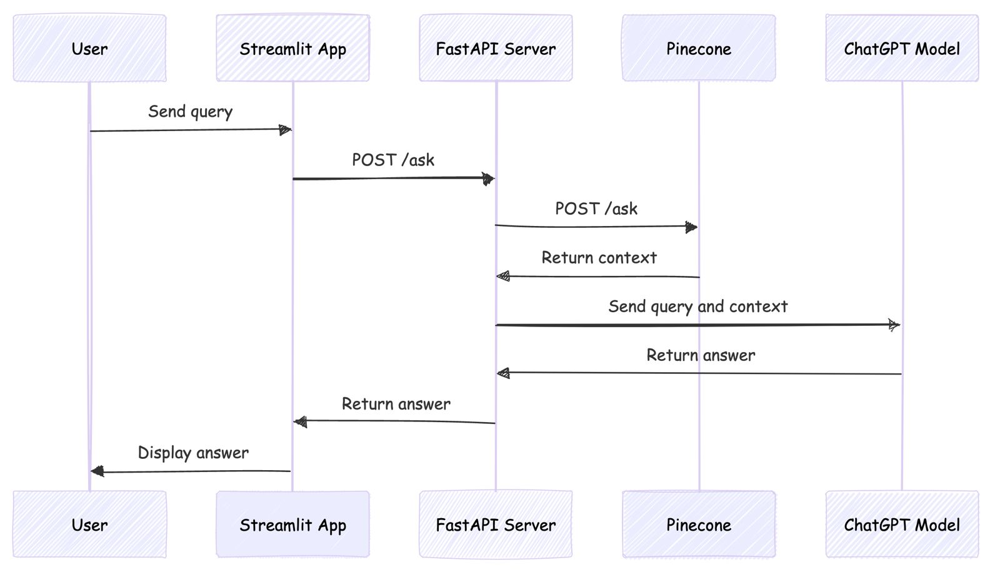
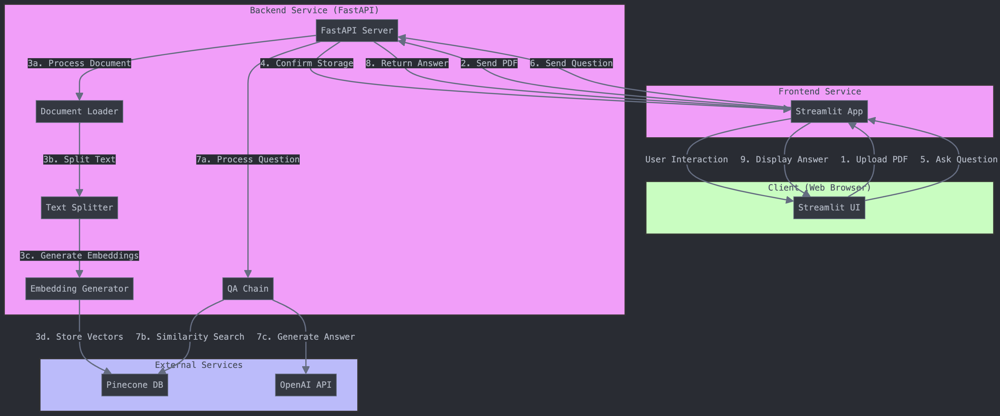

# Architecture Components Explanation
 
### HLD Diagram


### Sequence Diagram


### Low-Level Architectural Diagram


## 1. Client Layer

- **Web Browser**: Accesses the Streamlit UI
- **User Interactions**:
    - Document upload
    - Question input
    - Viewing answers

## 2. Frontend Service

- **Streamlit App**:
    - Handles user interface
    - Manages file uploads
    - Displays answers
    - Communicates with backend API

## 3. Backend Service

- **FastAPI Server**:
    - RESTful API endpoints
    - Document processing pipeline
    - Question answering logic

### Backend Components:

1. **Document Loader**:
    - Extracts text from PDFs
    - Handles different file formats (expandable)

2. **Text Splitter**:
    - Chunks documents into processable segments
    - Optimizes for context retention

3. **Embedding Generator**:
    - Creates vector embeddings of text
    - Uses OpenAI's embedding model

4. **QA Chain**:
    - Orchestrates the question answering process
    - Combines context retrieval and answer generation

## 4. External Services

1. **Pinecone Vector Database**:
    - Stores document embeddings
    - Performs similarity searches

2. **OpenAI API**:
    - Generates embeddings
    - Produces answers using GPT model

## Data Flow

1. Document Upload Flow:
   ```
   User → Streamlit → FastAPI → Processing Pipeline → Pinecone
   ```

2. Question Answering Flow:
   ```
   User Question → Streamlit → FastAPI → Pinecone (context) → OpenAI (answer) → FastAPI → Streamlit → User
   ```

## Scalability Considerations

- Pinecone handles vector scaling
- FastAPI enables async processing
- Separated frontend/backend for independent scaling